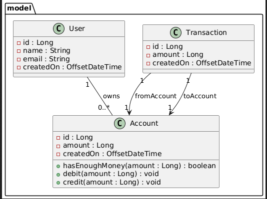
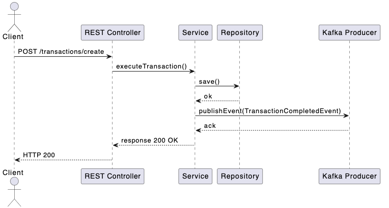
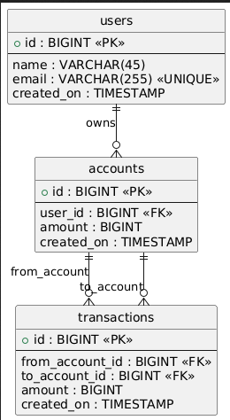

# AstroPay Demo API

A robust RESTful API application built with Spring Boot for managing users, accounts, and transactions. This project demonstrates best practices in Spring Boot development, including comprehensive testing, API documentation, and CI/CD integration.

## Table of Contents

- [Features](#features)
- [Technologies](#technologies)
- [Architecture](#architecture)
- [Prerequisites](#prerequisites)
- [Installation](#installation)
- [Configuration](#configuration)
- [Running the Application](#running-the-application)
- [API Documentation](#api-documentation)
- [Testing](#testing)
- [CI/CD](#cicd)
- [UML](#uml-diagram)
- [Secuence Diagram](#secuence-diagram-to-create-a-transaction)
- [DB Schema](#database-schema)

## Features

- **User Management**: Create and retrieve user accounts
- **Account Management**: Create accounts for users with initial amounts
- **Transaction Processing**: Transfer money between accounts with validation
- **RESTful API**: Well-structured REST endpoints with proper HTTP methods
- **Comprehensive Validation**: Input validation using Jakarta Bean Validation
- **Custom Exception Handling**: Centralized error handling with meaningful responses
- **Event-Driven Architecture**: Transaction event publishing and listening
- **Audit Logging**: AOP-based audit logging for critical operations
- **API Documentation**: Interactive Swagger/OpenAPI documentation
- **Health Monitoring**: Spring Boot Actuator with health and metrics endpoints
- **Prometheus Integration**: Metrics exposure for monitoring

## Technologies

### Core Framework
- **Spring Boot 4.0.1** - Application framework
- **Spring Data JPA** - Data access layer
- **Spring Web MVC** - REST API implementation
- **Hibernate 7.2.0** - ORM framework

### Database
- **MySQL** - Production database
- **H2** - In-memory database for testing
- **Liquibase 5.0.1** - Database migration management

### Server & Logging
- **Jetty** - Embedded servlet container
- **Log4j2** - Logging framework

### Testing
- **JUnit 5** - Testing framework
- **Mockito** - Mocking framework
- **Spring Boot Test** - Integration testing support
- **JaCoCo 0.8.12** - Code coverage analysis

### Documentation & Monitoring
- **SpringDoc OpenAPI 2.7.0** - API documentation
- **Spring Boot Actuator** - Application monitoring
- **Micrometer Prometheus** - Metrics collection

### Build & Dependencies
- **Maven 3.8.2+** - Build tool
- **Lombok** - Boilerplate code reduction

## Architecture

The application follows a layered architecture pattern:

```
┌─────────────────────────────────────┐
│         Controller Layer            │  ← REST endpoints, request/response handling
├─────────────────────────────────────┤
│          Service Layer              │  ← Business logic, transaction management
├─────────────────────────────────────┤
│        Repository Layer             │  ← Data access, JPA repositories
├─────────────────────────────────────┤
│          Model Layer                │  ← Entity definitions
└─────────────────────────────────────┘
```

### Key Components:

- **Controllers**: Handle HTTP requests and responses
- **Services**: Contain business logic and orchestrate operations
- **Repositories**: Provide database access using Spring Data JPA
- **Models**: JPA entities representing database tables
- **Aspects**: Cross-cutting concerns (logging, auditing)
- **Exception Handlers**: Centralized error handling
- **Validators**: Custom validation logic
- **Events**: Event-driven transaction processing

## Prerequisites

- **Java 21** or higher
- **Maven 3.8.2** or higher
- **MySQL 8.0** or higher (for production)
- **Git** (for version control)

## Installation

1. **Clone the repository**
   ```bash
   git clone <repository-url>
   cd demo
   ```

2. **Build the project**
   ```bash
   mvn clean install
   ```

3. **Set up MySQL database**
   ```sql
   CREATE DATABASE astropay;
   CREATE USER 'user'@'localhost' IDENTIFIED BY 'password';
   GRANT ALL PRIVILEGES ON astropay.* TO 'user'@'localhost';
   FLUSH PRIVILEGES;
   ```

## Configuration

### Application Configuration

The application uses YAML configuration files located in `src/main/resources/`:

#### application.yaml (Production)

Key configuration properties:

```yaml
spring:
  datasource:
    url: jdbc:mysql://localhost:3306/astropay
    username: user
    password: password
  jpa:
    properties:
      hibernate:
        dialect: org.hibernate.dialect.MySQLDialect
  liquibase:
    enabled: true
    change-log: classpath:changelog/db.changelog-master.xml

server:
  port: 8080
  servlet:
    context-path: "/astropay"

management:
  server:
    port: 8081
  endpoints:
    web:
      exposure:
        include: [health, prometheus]
```

#### application-test.yml (Testing)

Test configuration uses H2 in-memory database:

```yaml
spring:
  datasource:
    url: jdbc:h2:mem:testdb;MODE=MySQL
    username: sa
    password:
  jpa:
    properties:
      hibernate:
        dialect: org.hibernate.dialect.H2Dialect
        ddl-auto: create-drop
  liquibase:
    enabled: false
```

### Environment Variables

You can override configuration using environment variables:

- `MYSQL_HOST`: Database host (default: localhost)
- `MYSQL_PORT`: Database port (default: 3306)
- `MYSQL_DBNAME`: Database name (default: astropay)
- `MYSQL_USER`: Database username (default: user)
- `MYSQL_PASSWORD`: Database password (default: password)

## Running the Application

### Development Mode

Having a MYSQL DB running locally and the properties set in application.yml 
```bash
mvn spring-boot:run
```

### Docker (if available)

```bash
docker-compose up
```

The application will start on:
- **Main Application**: http://localhost:8080/astropay
- **Actuator/Metrics**: http://localhost:8081
- **Swagger UI**: http://localhost:8080/astropay/swagger-ui.html

## API Documentation

### Swagger/OpenAPI

Interactive API documentation is available at:
- **Swagger UI**: http://localhost:8080/astropay/swagger-ui.html
- **OpenAPI JSON**: http://localhost:8080/astropay/v3/api-docs

### Main Endpoints

#### User Management

| Method | Endpoint | Description |
|--------|----------|-------------|
| POST | `/astropay/users` | Create a new user |
| GET | `/astropay/users/{id}` | Get user by ID |

**Example: Create User**
```bash
curl -X POST http://localhost:8080/astropay/users \
  -H "Content-Type: application/json" \
  -d '{
    "name": "John Doe",
    "email": "john.doe@example.com"
  }'
```

#### Account Management

| Method | Endpoint | Description |
|--------|----------|-------------|
| POST | `/astropay/accounts` | Create a new account |
| GET | `/astropay/accounts/{id}` | Get account by ID |

**Example: Create Account**
```bash
curl -X POST http://localhost:8080/astropay/accounts \
  -H "Content-Type: application/json" \
  -d '{
    "userId": 1,
    "amount": 10000
  }'
```

#### Transaction Management

| Method | Endpoint | Description |
|--------|----------|-------------|
| POST | `/astropay/transactions` | Create a transaction |

**Example: Create Transaction**
```bash
curl -X POST http://localhost:8080/astropay/transactions \
  -H "Content-Type: application/json" \
  -d '{
    "fromAccount": 1,
    "toAccount": 2,
    "amount": 5000
  }'
```

### Response Format

All responses follow this structure:

**Success Response:**
```json
{
  "success": true,
  "data": {
    "id": 1,
    "name": "John Doe",
    "email": "john.doe@example.com",
    "createdOn": "2026-01-13T10:30:00Z"
  }
}
```

**Error Response:**
```json
{
  "success": false,
  "data": {
    "email": "email not valid"
  },
  "reason": "Invalid Fields Found"
}
```

## Testing

### Running Tests

```bash
# Run tests
mvn clean test
```

### Test Categories

The project includes comprehensive test coverage:

1. **Unit Tests**
   - Controller tests with Mockito
   - Service tests with mocked dependencies
   - Model tests for business logic
   - Validator tests
   - Utility tests

2. **Integration Tests**
   - Full Spring context loading
   - H2 in-memory database
   - End-to-end API testing

### Test Structure

```
src/test/java/
├── com.astropay.demo/
│   ├── controller/
│   │   ├── impl/          # Controller implementation tests
│   │   ├── request/       # Request DTO tests
│   │   └── response/      # Response DTO tests
│   ├── service/           # Service layer tests
│   ├── model/             # Entity tests
│   ├── config/            # Configuration tests
│   ├── validation/        # Custom validator tests
│   └── utils/             # Utility tests
```

### Viewing HTML Report

```bash
open target/site/jacoco/index.html
```

## CI/CD

### GitHub Actions Workflow

The project uses GitHub Actions for continuous integration and deployment:

**Workflow File**: `.github/workflows/branch-&-pr-workflow.yml`

**Triggers:**
- Push to any branch (except main)
- Pull request creation/update

**Pipeline Steps:**
1. Code checkout
2. Java 21 setup
3. Maven setup
4. Run tests with coverage
5. Upload JaCoCo report
6. Post coverage report to PR
7. Fail PR if coverage < 60%

**Required Permissions:**
- `contents: read` - Read repository code
- `pull-requests: write` - Post coverage comments on PRs
- `id-token: write` - OIDC authentication

### Example
PR with code coverage check [here](https://github.com/MatLock/astropay-ledge/pull/2)
Releases with PRs [here](https://github.com/MatLock/astropay-ledge/releases)

### Coverage Requirements

- **Minimum Overall Coverage**: 40%
- **Minimum Changed Files Coverage**: 60%
- **PR Fails if overall coverage < 60%**

## Health & Monitoring

### Health Check

```bash
curl http://localhost:8081/health
```

Response:
```json
{
  "status": "UP",
  "groups": ["liveness", "readiness"]
}
```

### Liveness & Readiness Probes

- **Liveness**: http://localhost:8081/health/liveness
- **Readiness**: http://localhost:8081/health/readiness

### Prometheus Metrics

```bash
curl http://localhost:8081/prometheus
```

## UML Diagram



## Secuence Diagram (to create a transaction)


## Database Schema



### Database Migrations

Database schema is managed using Liquibase. Migration files are located in:
```
src/main/resources/changelog/
```

## Error Handling

The application uses centralized exception handling with custom exceptions:

### Custom Exceptions

- `BadRequestException` - Invalid input (400)
- `NotFoundException` - Resource not found (404)
- `AlreadyExistsException` - Resource already exists (409)
- `ForbiddenException` - Forbidden access (403)

### Error Response Format

```json
{
  "success": false,
  "data": null,
  "reason": "User not found"
}
```

## Validation

### Built-in Validators

- `@NotNull` - Field cannot be null
- `@NotEmpty` - String cannot be empty
- `@ValidEmail` - Custom email validation


## Troubleshooting

**Issue: Liquibase migration fails**
- Solution: Check changelog files for syntax errors
- Drop database and recreate if needed

**Issue: Coverage report not generated**
- Solution: Ensure you run `mvn test` not just tests from IDE
- Check `target/site/jacoco/` directory exists

## License

This project is created for demonstration purposes.

## Contact

For questions or support, please open an issue in the repository.

---

jfflores90@gmail.com